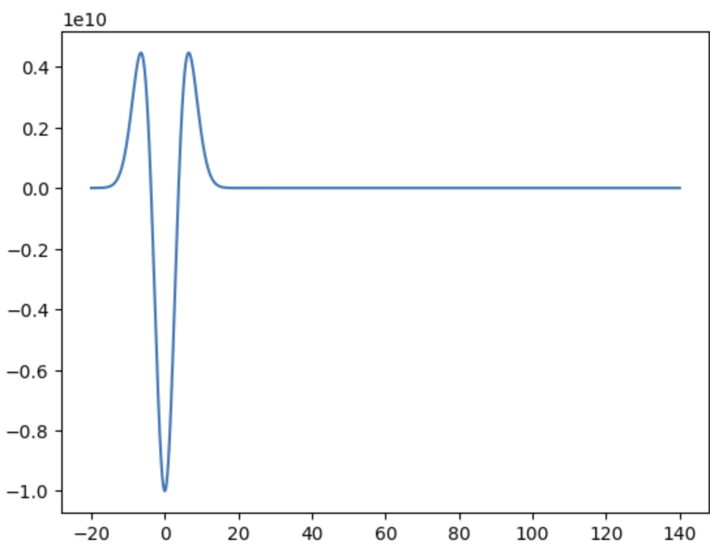
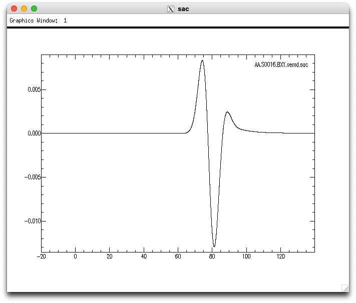
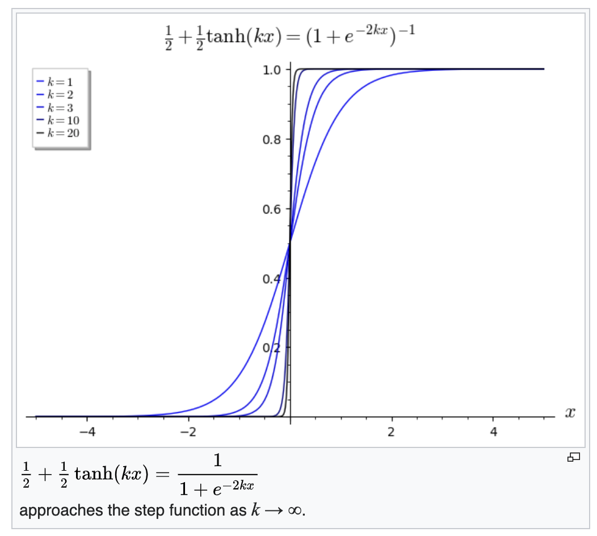
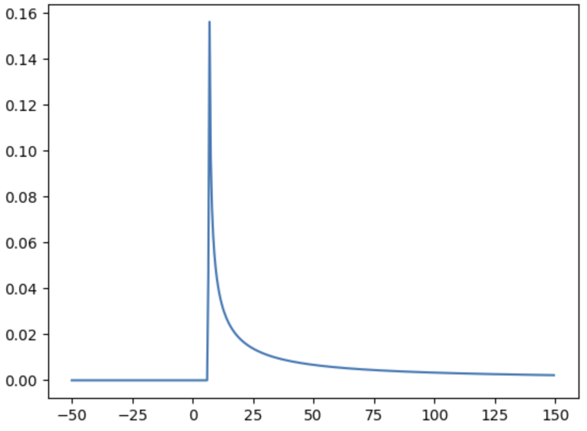
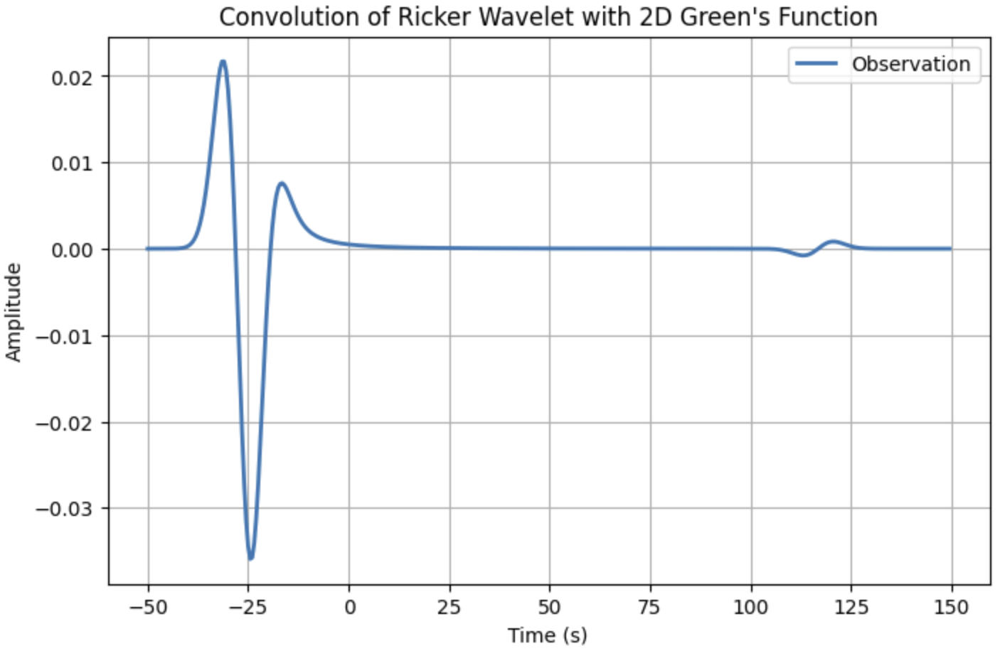
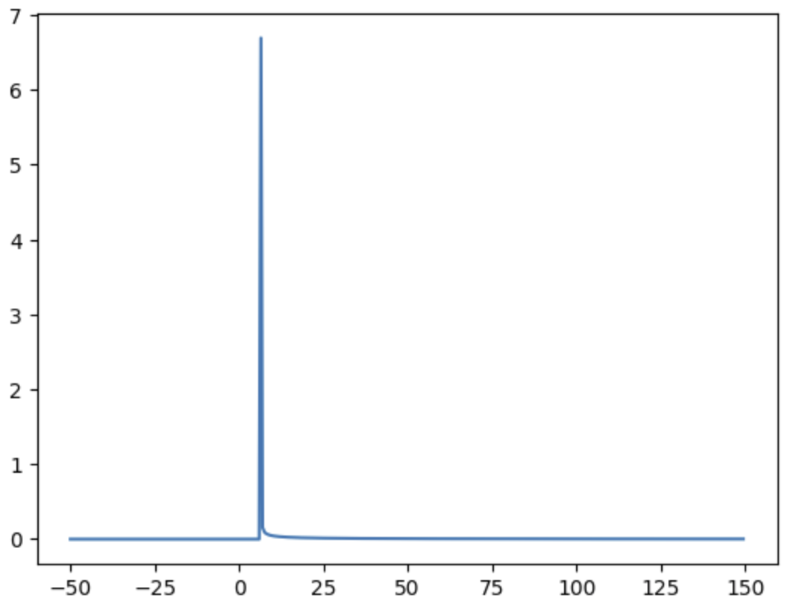
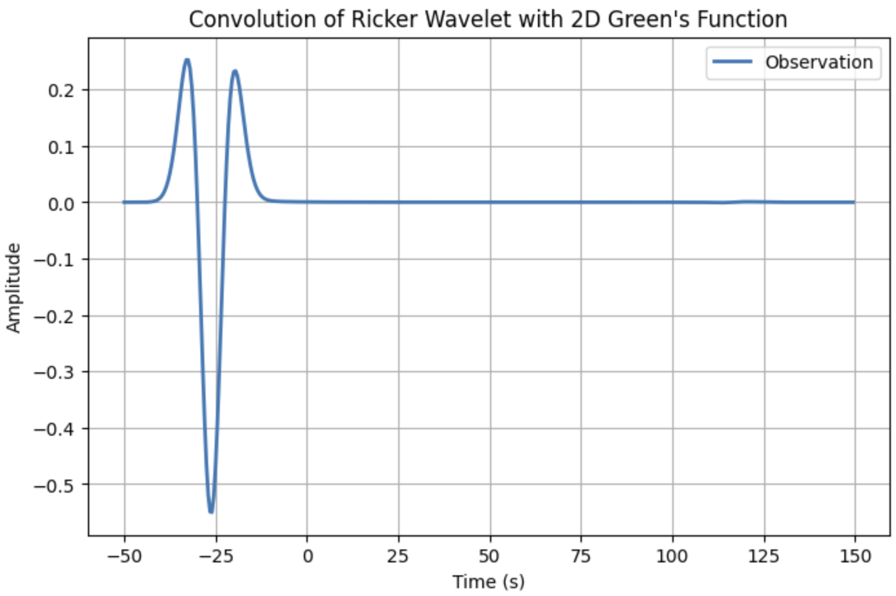
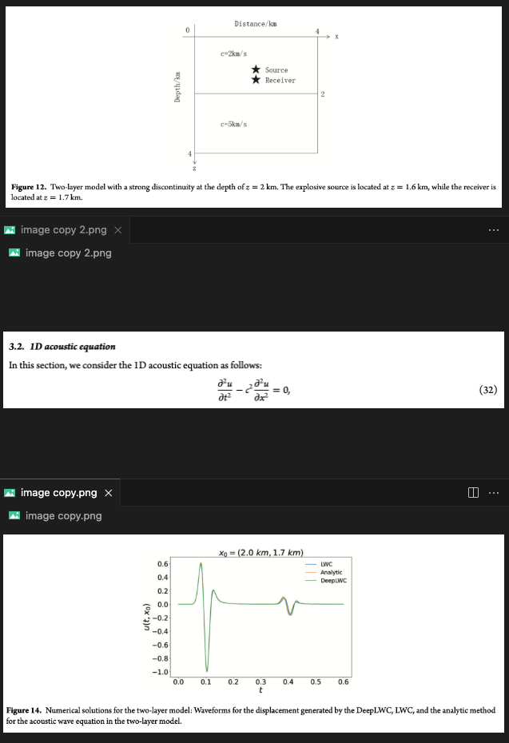

# 2D的非对称性

## 问题导出

2D 模拟中源设置成ricker wave, 但是台站接受到的并不是一个对称的ricker wave, 两端的凸起并不一样长.

源:


接收信号:


起初认为是数值计算误差.

## Green function
2D wave equation
$$
\partial^2_tu-c^2\nabla _{2D}u=0
$$

Green function
$$
\frac{H(ct-r)}{2\pi c\sqrt{c^2t^2-r^2}}
$$

where 
$$
r=\sqrt{x^2+y^2}
$$

$H(ct-r)$ is Heaviside step function

注意到格林函数并不是直接的**狄拉克函数**, 所以卷积上源后当然不会拥有狄拉克函数的**卷积即搬运**的性质, 台站接收到的信号不对称是正常的.

H 和 狄拉克函数的关系:
$$
\delta(x)=\frac{dH(x)}{dx}
$$
$$
H(x):=\int^x_{-\infin}\delta(s)ds
$$
### step function

[website](https://en.wikipedia.org/wiki/Heaviside_step_function)

注意数值计算中不要直接用这种定义:
$$
H(x):= \begin{cases}
    0,&x<0\\
    1,&x\geq0
\end{cases}
$$
误差太大. 可以用以下连续函数来近似:
$$
H(x):=\frac{1}{1+e^{-2kx}}
$$



### 分母为0的处理

分母有一个$\sqrt{c^2t^2-r^2}$:
* 当它趋于0时,分子为1,则整个Green function趋于无穷大. 
* 当它等于0时,分子为1,则Green为无穷大
* 当它小于0时,分子为0,分母开根号为复数,Green 为0
  
则比较麻烦的是这个无穷大的处理, 可以定义为加上一个无穷小量,至于小于0的部分也要注意,需要保证近似后的H比近似后的分母小得多!保证其为0:
```
def SQ(x):
    a=[]
    for t in x:
        if t<=0:
            a.append(1e-3)
        elif t>0:
            a.append(np.sqrt(t))
    return np.array(a)
```
不能直接用*小于0时加上小误差*, 比如为-1, 加上小误差之后开根还是为负, 会报错
## 实操

### k=10
近似 $H$ 时取 $k=10$, 分母用上述代码,定义小误差$10^{-3}$. 则得到格林函数如下:


卷积
$$
f*G
$$

暂时不清楚后面那个横坐标125处的wave怎么来的.

* 到时是否对得上不是本文关注的内容, 这需要调整和理解python的卷机函数来实现
* 振幅的绝对大小也有问题, 需要考察格林函数的近似效果, 比如这里最大值为0.16,可能不合理
 
本文重点关注的波的形态. 发现两个“肩膀”确实不对称, 和sem数值模拟的结果相似

### k=5
这时H的step没有那么陡,分母趋近于0时的值很大,相应地,格林函数最大值就比较大,整个形状近似出来更接近一个尖锐的狄拉克函数:

这个时候再做卷机,得到的结果也更近似**狄拉克函数的搬运效果**


## 并不是我的sem计算设置出错导致的shoulder不对称
在下面文章中也出现了这样的现象:

Chang, Yunfan, Dinghui Yang, and Xijun He. "A deep learning operator-based numerical scheme method for solving 1-D wave equations." Journal of Geophysics and Engineering (2024): gxae062.


1. 作者并没有直接提到所用的2D波动方程,但是根据1D的来推断,应该和我地震学中的是同一个
2. 作者并不是单一介质,而是双层. 但是源和台站在同一个介质中,在遇到界面之前还是一个单一介质的问题
3. 震中距0.1km,波速说2km/s. 走时和子图3的有差别, 有可能是子波给了time shift
4. 作者没有说2D用的什么类型的源. 最恶劣的情况就是他故意用了一个不对称的像ricker wave,但又不是的. 我觉得这种可能性应该是没有的, 正常人应该不会这么无聊吧?....
## 总结

<span style="color:rgb(213, 79, 79);">2D的格林函数, 波场都不是“对称”的, 注意不要错误想象!!</span>

顺便也解释了另两个现象:
1. 当sem设置的源是冲击源的时候,模拟出来的波场不是一个干净的冲击,而是带有长长的衰减的尾巴. 
2. 当sem设置的源是正弦函数的时候,台站接收到的也不是一个sin函数,而是直观看来整体带有一个倾斜的趋势,(甚至可能形状和sin还有出入,这一点尚未考证).
## 测试用的代码
```
import numpy as np
import scipy.signal as signal
import matplotlib.pyplot as plt

# Parameters
f0 = 0.06  # Central frequency (Hz)
c = 3.0    # Wave speed (m/s)
dt = 0.5   # Time step (s)
t = np.arange(-50, 150, dt)  # Time vector

# Generate Ricker wavelet
def ricker_wavelet(t, f0):
    """Ricker wavelet (second derivative of Gaussian)."""
    t0 = 1.0 / f0  # Central time shift
    pi_f0_t = np.pi * f0 * (t - t0)
    return -(1 - 2 * pi_f0_t**2) * np.exp(-pi_f0_t**2)

ricker = ricker_wavelet(t, f0)

# Compute Green's function for 2D wave equation
def H(x):
    k=5
    return 1/(1+np.exp(-2*k*x))

def SQ(x):
    a=[]
    for t in x:
        if t<=0:
            a.append(1e-3)
        elif t>0:
            a.append(np.sqrt(t))
    return np.array(a)

def green_function_2d(r, t, c):
    """2D wave equation Green's function."""
    t_shifted = c*t - r
    return H(t_shifted)/(2*np.pi*SQ(c**2*t**2-r**2))


r = 20  # Distance from source (m)
green = green_function_2d(r, t, c)

# Convolve Ricker wavelet with Green's function
observation = signal.convolve(ricker, green, mode='same') * dt

# Plot results
plt.figure(figsize=(8, 5))
# plt.plot(t, ricker, label="Ricker Wavelet", linestyle="--")
# plt.plot(t, green, label="Green's Function")
plt.plot(t,observation, label="Observation", linewidth=2)
plt.xlabel("Time (s)")
plt.ylabel("Amplitude")
plt.legend()
plt.title("Convolution of Ricker Wavelet with 2D Green's Function")
plt.grid()
plt.show()
```